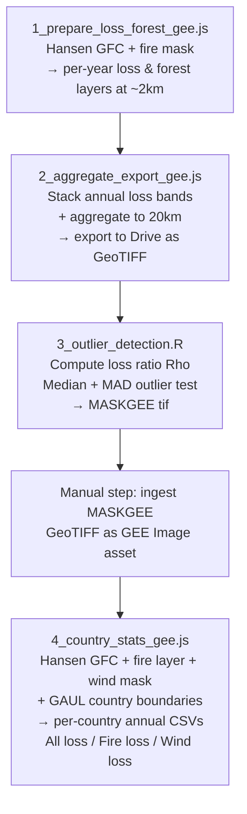

# Forest Disturbance Attribution Pipeline (Hansen GFC × Fire × Wind)

This repository documents a processing pipeline that combines the **Hansen Global
Forest Change (GFC)** dataset with a global **fire-driven forest loss** product
(Tyukavina et al.) to separate forest loss into **fire-related** and
**non-fire (background/other disturbance)** components, statistically flag
**anomalous ("outlier") loss events** as likely large-scale windthrow/storm
damage, and finally produce **country-level annual statistics** of forest loss
attributed to fire, wind, and all other drivers.

The pipeline spans two environments:

- **Google Earth Engine (GEE)** — JavaScript code editor scripts for raster
  processing, aggregation, and export.
- **R** — post-processing of GEE exports to detect statistical outliers
  (windthrow mask), which is then re-ingested into GEE as an asset.

## Pipeline overview



## 1. Data sources

| Dataset | Asset ID | Role |
|---|---|---|
| Hansen Global Forest Change v1.13 (2025) | `UMD/hansen/global_forest_change_2025_v1_13` | Tree cover 2000, annual loss, loss year, gain |
| Tyukavina et al. fire-driven forest loss (annual) | `users/sashatyu/2001-2025_fire_forest_loss_annual` | Per-pixel year of fire-attributed loss, used to mask out fire pixels |
| Tyukavina et al. fire-driven forest loss (driver class) | `users/sashatyu/2001-2025_fire_forest_loss` | Driver class 3–5 used as a fire flag |
| LSIB Simple country boundaries | `USDOS/LSIB_SIMPLE/2017` | Country-level clipping (early exploratory step, largely commented out) |
| GAUL Level 1 boundaries | `FAO/GAUL/2015/level1` | Country boundaries used for the final zonal statistics (via `ADM0_CODE`) |
| Curtis et al. deforestation drivers | `projects/tmf-monitoring/assets/CurtisDrivers2018/FilledMap` | Used to restrict the analysis to a specific driver class (class 3) |
| Custom windthrow mask (this pipeline's own output) | `projects/ee-guido/assets/MASKGEE2025Fires` | Statistically derived flag of anomalous loss years per 20km cell (see R script) |

## 2. Script-by-script description

### 2.1 `1_prepare_loss_forest_gee.js` — Forest & annual loss preparation (GEE)

**Purpose:** build a forest/non-forest baseline from Hansen GFC, remove fire
pixels, split annual loss into yearly binary masks, and aggregate everything
from native 30 m resolution to a coarser regular grid (~2 km, `scale =
2226.39` m, `EPSG:4326`, 0.02° pixels) for tractable global export.

**Key steps:**
1. Load Hansen GFC 2025 v1.13 and the Tyukavina annual fire-loss mosaic
   (`EFFIS_TOT`), unmasking the latter so non-fire pixels become 0.
2. Define a **forest threshold** (`treecover2000 ≥ forest_threshold`, default
   10%) to build a forest/non-forest mask.
3. Mask out pixels with `gain = 1` (avoid conflating gain with loss/forest).
4. Mask out any pixel flagged as fire loss in the Tyukavina product
   (`EFFIS_TOT.select('b1').eq(0)` keeps only non-fire pixels), so the
   resulting `treecover`/`lossyear` layers represent **non-fire forest loss
   only**.
5. Decompose `lossyear` into 25 individual binary layers, one per year
   (`loss_2001` … `loss_2025`), each equal to 1 where loss occurred in that
   year and the pixel was forest.
6. Build a cumulative **forest-state** stack (`forest2000` → `forest2025`) by
   progressively zeroing out pixels lost in each year (note: due to a copy‑paste
   pattern from `forest2022` onward, later "cumulative" layers are not fully
   chained — see *Known issues* below).
7. Compute `Pixel_per_cell`: for each output cell, the count of native 30 m
   Landsat pixels contained within it (used downstream in R to normalize
   percentages).
8. Aggregate every yearly loss layer and the forest layer from 30 m to
   ~2 km using `reduceResolution(ee.Reducer.sum().unweighted(), maxPixels =
   65536)` followed by `reproject` to a 0.02°/pixel `EPSG:4326` grid. This
   yields, for each cell, the **count of lost/forest 30 m pixels**.
9. Export each yearly loss layer (`loss_2001_at_15km` … `loss_2025_at_15km`,
   note the variable name references "15km" but the reprojection scale is
   actually ~2 km) and the `forest2000_at_15km` layer as **GEE Image assets**
   (`Export.image.toAsset`), clipped to a study region `AOItot` (must be
   defined/drawn in the code editor — not included in the script as shown).

**Outputs (GEE assets):**
- `Forest2000_at_2km_2025GlobalFires_10`
- `loss_2001_at_2km_2025GlobalFires_10` … `loss_2025_at_2km_2025GlobalFires_10`
  (one asset per year, 2001–2025)

**Note:** most `Export.image.toAsset` calls for individual years must be run
manually one at a time (or via GEE's Task queue), as each is a separate task.

---

### 2.2 `2_aggregate_export_gee.js` — Stacking and 20 km aggregation (GEE)

**Purpose:** load the previously exported per-year assets, stack them into a
single multi-band image, further aggregate to a coarser 20 km grid, and
export the results to Google Drive as GeoTIFFs for R analysis.

**Key steps:**
1. Load the `Forest2000_at_2km...` asset and each `loss_YYYY_at_2km...` asset
   (2004–2025) produced by script 1.
2. Stack all annual loss images into a single multi-band image `Final_loss`
   (one band per year, 2004–2025).
3. Aggregate `Final_loss` from ~2 km to 20 km (`scale = 0.2°`,
   `22263.898` m) using the same
   `reduceResolution(sum, unweighted) → reproject` pattern, summing pixel
   counts across the coarser cell.
4. Aggregate the `Forest2000` layer the same way, to obtain the number of
   forest pixels per 20 km cell.
5. Export both aggregated images to **Google Drive** (`Export.image.toDrive`)
   as `FinalLoss_at_20km_2025Fires.tif` and `Forest2000_at_20km_2025Fires.tif`.

**Outputs (Google Drive, GeoTIFF):**
- `FinalLoss_at_20km_2025Fires.tif` — multi-band, one band per year of
  non-fire forest loss (pixel counts) at 20 km
- `Forest2000_at_20km_2025Fires.tif` — forest pixel count at 20 km

---

### 2.3 `3_outlier_detection.R` — Statistical outlier (windthrow) detection

**Purpose:** using the 20 km rasters exported from GEE, compute a normalized
loss ratio per year and cell, and flag cells/years where loss is a
statistical outlier relative to the cell's own long-term distribution — used
as a proxy for large, discrete disturbance events (e.g., windstorms) rather
than the diffuse background of loss.

**Key steps:**
1. Load `FinalLoss_at_20km_2025Fires.tif` (`Final_loss`, multi-band, one band
   per year) and `Forest2000_at_20km_2025Fires.tif` (`Forest`, single band)
   with the `raster` package.
2. Note the number of native 30 m Landsat pixels contained in one 0.2°
   cell (**640,000**), used to convert forest pixel counts to a forest
   fraction (`Forest / 640000`).
3. Compute **Rho**: forest loss as a **percentage of forest area per cell per
   year** — `Rho = (Final_loss / Forest[[1]]) * 100`. Zero values are set to
   `NA` (no loss recorded).
4. Compute, per cell, across all years:
   - `RhoM` — per-pixel **median** of Rho across years
   - `RhoMean` — per-pixel **mean**
   - `Rhomad` — per-pixel **MAD** (median absolute deviation)
   - `Rhosd` — per-pixel **standard deviation**
5. Flag an outlier year/cell as `Rho > (RhoM + 3·MAD)` **and** `Rho > 3%`
   **and** forest fraction `> 5%` (to exclude near-zero-forest cells from
   spurious ratios). Flagged cells/years are set to `100`, everything else to
   `NA`, then binarized to `1`.
6. Collapse the multi-year outlier stack to a single band with `max()`,
   producing a binary "has this cell ever had an outlier loss year" summary
   (`Rho2`, plotted for QA) — while the *per-year* binary outlier stack (also
   called `Rho2`, recomputed just below without the `max()` collapse) is what
   is actually written to disk.
7. Write two GeoTIFFs:
   - `MASKGEE2025Fires.tif` — the multi-band, per-year **binary outlier mask**
     (1 = statistically anomalous loss year for that cell, i.e. candidate
     wind/storm disturbance)
   - `ForestHarvest_04_25Fires.tif` — the underlying multi-band `Rho`
     (percent loss) raster, saved for reference/inspection

**Outputs:**
- `Data2025/MASKGEE2025Fires.tif` (binary outlier/windthrow mask, per year)
- `Data2024/ForestHarvest_04_25Fires.tif` (percent-loss raster, per year)

**Manual step (not scripted):** `MASKGEE2025Fires.tif` is manually uploaded
and ingested as a GEE **Image asset**
(`projects/ee-guido/assets/MASKGEE2025Fires`), which becomes the `WindMap`
input of the final script.

---

### 2.4 `4_country_stats_gee.js` — Country-level annual statistics (GEE)

**Purpose:** produce per-country, per-year forest loss statistics (area in
m²) split into three categories — **all non-forest-driver loss**, **fire
loss**, and **wind loss** — using native-resolution (30 m) Hansen GFC data,
restricted to a specific deforestation-driver class from Curtis et al., and
exported as CSV per country.

**Key steps:**
1. Load the windthrow mask asset (`WindMap`,
   `projects/ee-guido/assets/MASKGEE2025Fires`, output of the R script),
   the GAUL Level 1 country boundaries, the Curtis et al. driver map, and the
   Tyukavina fire-loss products (both the coarse driver-class mosaic and the
   annual mosaic).
2. Build a fire flag `fire_loss` = Curtis-independent Tyukavina driver values
   in **[3, 5]** (i.e., fire-related driver classes).
3. Convert `WindMap`'s per-year binary bands (`b8`…`b22`, corresponding to
   loss years 2011–2025) into a single-band categorical `WIND_TOT` image
   where pixel value = the **year** (11–25, i.e. 2011–2025) in which an
   outlier/wind event was flagged for that cell (later bands overwrite
   earlier ones where multiple years are flagged, so `WIND_TOT` keeps the
   most recent flagged year encountered in iteration order).
4. Derive `WIND_1621`: a binary layer, 1 where `WIND_TOT ≥ 11`
   (i.e., any flagged wind year from 2011 onward), 0 elsewhere — the wind
   mask used to split loss into "wind" vs "not wind".
5. Restrict analysis to `CURTIS.eq(3)` (a specific deforestation driver class
   from the Curtis et al. map, e.g. one of the "commodity-driven" or similar
   classes depending on the Curtis legend) by masking `gfc` before extracting
   `treecover`, `gain`, `loss`, `lossyear`.
6. Iterate over a **hard-coded list of ~271 country codes**
   (`list_c`, GAUL `ADM0_CODE` values), their 2-letter labels (`list_cL`), and
   per-country **forest-cover thresholds** (`list_t`, ranging 10–50%,
   presumably calibrated per country/biome). The loop as shown runs `y = 150`
   to `206` (i.e., a specific subset of the country list — adjust the loop
   bounds to process all countries).
7. For each country:
   - Build the forest mask at the country-specific threshold.
   - **Export 1 — "All loss":** `loss` masked to forest, multiplied by pixel
     area, grouped-summed by `lossyear` within the country geometry
     (simplified to 5 km tolerance), reducer resolution 30 m. Reshaped from
     long to wide format and exported as
     `Country_Forest_Change_EUOBS_<code>.csv`.
   - **Export 2 — "Fire loss":** `loss` masked to forest **and** to
     `WIND_1621.eq(0)` (i.e., loss that is *not* flagged as wind), grouped by
     the Tyukavina annual fire-year band (`b1`). Exported as
     `Country_Forest_Change_EUOBS_fires<code>.csv`.
   - **Export 3 — "Wind loss":** `loss` masked to forest **and** to
     `WIND_1621.eq(1)` (i.e., loss flagged as an outlier/wind year), grouped
     by `lossyear`. Exported as
     `Country_Forest_Change_EUOBS_Wind<code>.csv`.
   - All three tables are exported to Google Drive folder `EUForObs11_25`.

**Outputs (Google Drive CSVs, per country, per category):**
- `Country_Forest_Change_EUOBS_<CC>.csv` — total forest loss area by year
- `Country_Forest_Change_EUOBS_fires<CC>.csv` — fire-attributed loss area by
  year
- `Country_Forest_Change_EUOBS_Wind<CC>.csv` — wind/outlier-attributed loss
  area by year

## 3. Requirements

**Google Earth Engine**
- A GEE account/project with write access to `projects/ee-guido/assets/...`
  (or update asset paths to your own project).
- Access to the public assets listed in §1 (Hansen GFC, `USDOS/LSIB_SIMPLE`,
  `FAO/GAUL/2015/level1`) and to the third-party `users/sashatyu/...` and
  `projects/tmf-monitoring/...` assets (verify sharing/visibility with the
  asset owners if access fails).
- A geometry named `AOItot` (study area) and `countries` must be defined in
  the GEE Code Editor session — they are referenced but not created in the
  scripts as provided.

**R**
- R ≥ 4.x with packages: `raster`, `tidyverse` (only `raster` functions are
  actually used in the shown code; `sp`/`rgdal`/`rgeos` are commented out as
  legacy/deprecated dependencies).
- Local folder structure: `Data2025/` (containing the GEE Drive exports) and
  `Data2024/` (output location for the reference percent-loss raster).

## 4. Known issues / things to check before re-running

- **`AOItot` and `countries`** are used but never defined in the provided
  scripts — they must exist as drawn geometries or be added at the top of
  script 1 and script 4.
- In script 1, the cumulative `forestYYYY` chain is built correctly through
  `forest2021`, but `forest2022`, `forest2023`, `forest2024`, and `forest2025`
  are all derived from `forest2020` rather than chaining from the previous
  year — this looks like a copy-paste bug and should be fixed
  (`forest2022 = forest2021.where(loss_2022.eq(1), 0)`, etc.) if the
  cumulative forest-state layers for 2022–2025 are needed downstream.
- In script 4, `WIND_TOT` is built by sequentially overwriting a single band
  with `.where()` calls per year; where a cell qualifies in multiple years,
  only the **last-applied** (highest band index, i.e. most recent year in the
  iteration order 2011→2025) value survives — this is a "most recent
  qualifying year" encoding, not a full year-by-year record.
- The exploratory EU-boundary filtering block (`EU`, `EU_b`) and the
  `MaskEFFIS`/`FIRES` block at the top of script 1 are commented out; confirm
  whether a study-area restriction is still intended before large-scale runs.
- Script 4's country loop currently runs only `y = 150` to `206`; extend to
  `y = 0` … `list_c.length - 1` to process the full country list, or run in
  batches to stay within GEE's concurrent task limits.
- Variable names containing `_at_15km` in script 1 actually correspond to a
  ~2 km (0.02°) reprojection, not 15 km — naming is inherited from an earlier
  version of the pipeline and does not reflect the actual scale used.
- `Export.image.toAsset` / `Export.table.toDrive` tasks are **not** executed
  automatically — each must be manually started (or scripted via the GEE
  batch/Tasks API) from the Tasks tab in the Code Editor.

## 5. Suggested repository layout

```
.
├── README.md
├── gee/
│   ├── 1_prepare_loss_forest_gee.js
│   ├── 2_aggregate_export_gee.js
│   └── 4_country_stats_gee.js
├── r/
│   └── 3_outlier_detection.R
└── data/
    ├── Data2025/        # GEE Drive exports + MASKGEE output (not versioned; large files)
    └── Data2024/         # reference percent-loss raster
```
