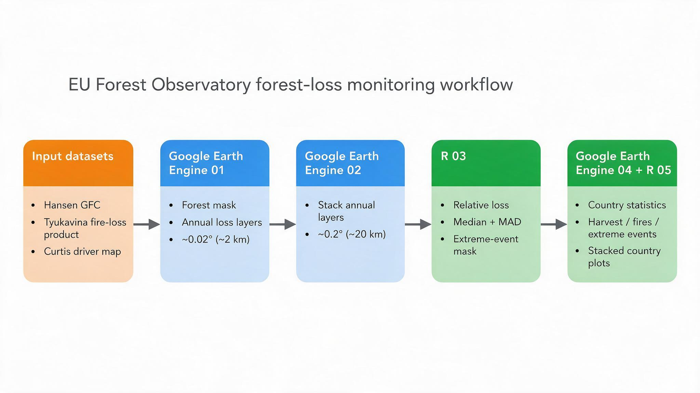
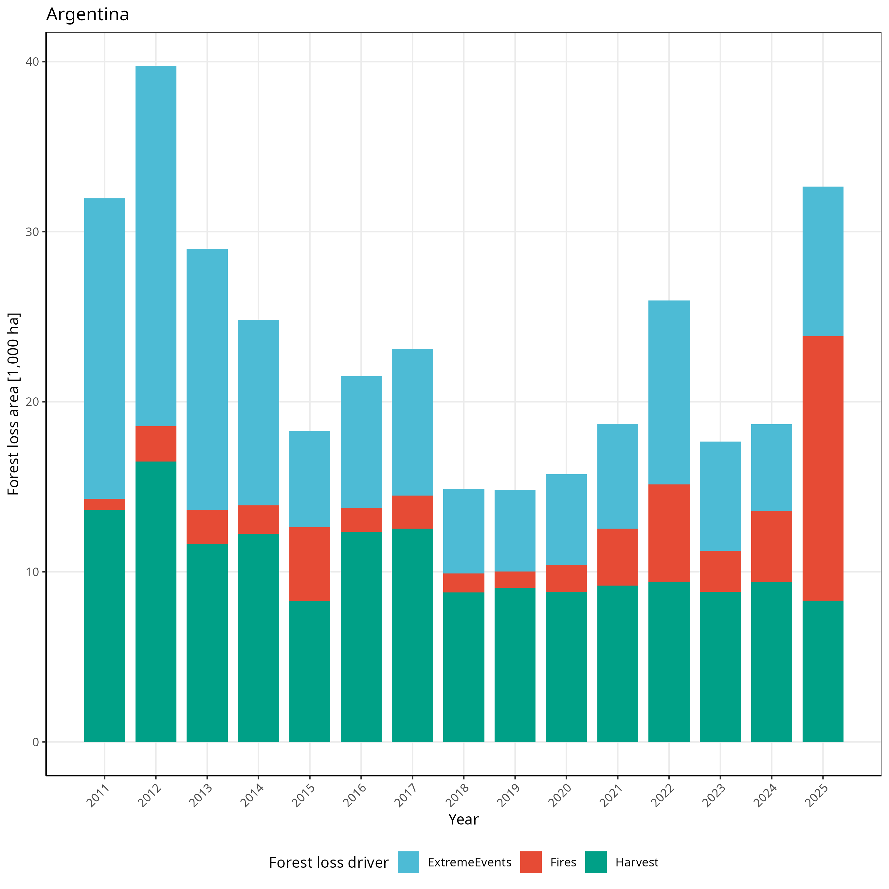

---
output:
  pdf_document: default
  html_document: default
---

# EU Forest Observatory: Forest Loss Monitoring

Google Earth Engine and R workflow for producing annual forest-loss layers, aggregating them to approximately 2 km and 20 km grids, detecting extreme loss events, and generating country-level statistics and plots by disturbance type.

## Overview

This repository documents a research workflow developed in the context of activities related to the EU Forest Observatory. It provides practical scripts for processing satellite-derived forest-loss data, identifying unusually large loss events, and producing country-level summary statistics and plots. The material is intended to support analysis and reproducibility; it should not be interpreted as an official EU Forest Observatory product or as a formally endorsed operational methodology. The workflow consists of:

1.  Hansen Global Forest Change data for tree cover and annual forest loss.
2.  The Curtis et al. forest-loss-driver map to restrict the analysis to forestry-related loss.
3.  An annual fire-related forest-loss product used to exclude fire-affected pixels from the harvest-oriented loss signal.
4.  A first Google Earth Engine aggregation from the native approximately 30 m Hansen grid to a nominal 0.02-degree grid, approximately 2 km.
5.  A second Earth Engine aggregation from the approximately 2 km layers to a 0.2-degree grid, approximately 20 km.
6.  An R-based robust outlier procedure applied to the 20 km rasters. The procedure uses the temporal median and median absolute deviation (MAD) of relative annual loss to identify unusually large loss events.
7.  A final Google Earth Engine workflow that produces country-level annual statistics for total loss, fire-related loss, and extreme-loss events.
8.  An R workflow that reads the country-level CSV outputs directly, derives the harvest component, and produces one stacked bar plot per country.

The analysis follows the conceptual approach described by Ceccherini et al. (2020), including spatial aggregation, exclusion of fire-affected loss, and separation of abrupt or extreme disturbances from the normal loss signal. The reproducibility materials for the original study are available through Zenodo: [code](https://doi.org/10.5281/zenodo.3687096) and [data](https://doi.org/10.5281/zenodo.3687090).



*Figure 1. Processing workflow for the EU Forest Observatory forest-loss monitoring chain. Hansen Global Forest Change, Tyukavina fire-loss, and Curtis driver data are processed in Google Earth Engine, aggregated to approximately 2 km and 20 km grids, analysed in R to identify extreme loss events, and returned to Earth Engine for country-level statistics. The final country CSV files are processed in R to generate stacked plots of harvest, fire-related loss, and extreme events.*

## Repository structure

``` text
.
|-- README.md
|-- docs/
|   `-- figures/
|       `-- workflow_overview.png
|-- gee/
|   |-- 01_prepare_annual_loss_assets.js
|   |-- 02_aggregate_to_20km.js
|   `-- 04_country_statistics.js
|-- R/
|   |-- 03_detect_extreme_loss.R
|   `-- 05_plot_country_forest_loss.R
`-- data/
    |-- raw/
    |   |-- FinalLoss_at_20km_2025Fires.tif
    |   `-- Forest2000_at_20km_2025Fires.tif
    |-- intermediate/
    |   |-- MASKGEE2025Fires.tif
    |   |-- Country_Forest_Change_EUOBS_<CODE>.csv
    |   |-- Country_Forest_Change_EUOBS_fires<CODE>.csv
    |   `-- Country_Forest_Change_EUOBS_Wind<CODE>.csv
    `-- processed/
        `-- country_forest_loss/
            |-- <GEE_CODE>.csv
            |-- AllCountries_ForestLoss.csv
            `-- figures/
                `-- Plot_<GEE_CODE>.png
```

The exact asset IDs, Earth Engine project names, and local file paths should be adapted to the execution environment. The scripts use legacy project-specific names in several places; these are documented below.

## Workflow

### 1. Prepare annual loss assets

`gee/01_prepare_annual_loss_assets.js` loads:

-   `UMD/hansen/global_forest_change_2025_v1_13`;
-   `users/sashatyu/2001-2025_fire_forest_loss_annual`;
-   a large analysis region represented by `AOItot`.

`AOItot` defines a near-global WGS84 analysis polygon. It covers almost the entire globe while excluding the extreme polar caps according to the polygon supplied in the script.

The Hansen product is a Landsat-derived global forest-change dataset covering 2000–2025. Its main bands used here are:

-   `treecover2000`: canopy cover in 2000, expressed as a percentage;
-   `gain`: forest-gain flag;
-   `lossyear`: annual loss code, with values 1–25 corresponding to 2001–2025.

The official dataset documentation is available in the [Earth Engine Data Catalog](https://developers.google.com/earth-engine/datasets/catalog/UMD_hansen_global_forest_change_2025_v1_13).

#### Forest and fire masks

The script applies the following masks:

-   `treecover2000 >= forest_threshold`, with a default global threshold of 10%;
-   `gain < 1`, excluding pixels classified as forest gain;
-   annual fire mask equal to zero, excluding pixels identified by the Tyukavina et al. fire product.

The fire mask is applied when preparing the harvest-oriented loss layers. Fire-related loss is subsequently quantified separately in the country-statistics workflow.

#### Annual loss layers

For each year, a binary loss image is produced using expressions of the form:

``` javascript
var loss_2025 = lossyear.eq(25);
```

The script also constructs a cumulative forest-presence sequence beginning with forest cover in 2000. These layers represent the forest denominator or forest presence through time and can be used in subsequent analyses.

#### Aggregation and exports

Each annual binary loss layer and the 2000 forest layer is aggregated using:

``` javascript
.reduceResolution(ee.Reducer.sum().unweighted(), false, 65536)
.reproject(ee.Projection('EPSG:4326').scale(0.02, 0.02))
```

The output is a sum of native source pixels within each target cell. It should therefore initially be interpreted as a count of native pixels, not as hectares, square kilometres, or a percentage.

The script exports one Earth Engine asset for each annual loss layer and one asset for the 2000 forest denominator. Names follow the pattern:

``` text
Forest2000_at_2km_2025GlobalFires_10
loss_YYYY_at_2km_2025GlobalFires_10
```

The legacy names contain `at_2km`, but the actual target grid is defined by `0.02` degrees. At the equator this is approximately 2.2 km. Physical cell dimensions vary with latitude because the grid is geographic rather than a constant-distance metric projection.

### 2. Aggregate annual assets to approximately 20 km

`gee/02_aggregate_to_20km.js` loads the annual approximately 2 km loss assets, combines them into a multiband image, and aggregates them to a 0.2-degree grid:

``` javascript
var Final_loss_at_20km = Final_loss
  .reduceResolution(ee.Reducer.sum().unweighted(), false, 65536)
  .reproject(ee.Projection('EPSG:4326').scale(0.2, 0.2))
  .updateMask(1);
```

The script exports:

-   `FinalLoss_at_20km_2025Fires.tif`, containing annual loss bands;
-   `Forest2000_at_20km_2025Fires.tif`, containing the aggregated 2000 forest denominator.

The output is nominally approximately 20 km at the equator. It is not a constant metric 20 km grid globally.

The current supplied version of the aggregation script loads annual loss assets beginning in 2004. Consequently, the R time series and the subsequent extreme-event analysis should be interpreted according to the years actually present in the exported GeoTIFFs.

### 3. Detect extreme loss events in R

`R/03_detect_extreme_loss.R` reads the two GeoTIFFs produced by the previous Earth Engine step. In other words, the R workflow uses the output of the approximately 20 km Earth Engine aggregation as its input:

``` r
Final_loss <- stack(
  "data/raw/FinalLoss_at_20km_2025Fires.tif"
)

Forest <- stack(
  "data/raw/Forest2000_at_20km_2025Fires.tif"
)
```

The annual relative-loss series is calculated as:

``` r
Rho <- (Final_loss / Forest[[1]]) * 100
Rho[Rho == 0] <- NA
```

For every 0.2-degree cell, the script calculates temporal summary statistics:

-   median;
-   mean;
-   median absolute deviation (MAD);
-   standard deviation.

The extreme-event rule is:

``` r
Rho > RhoM + (3 * Rhomad) &
Rho > 3 &
(Forest / 640000) > 0.05
```

A cell-year is flagged when:

1.  relative annual loss is greater than the temporal median plus three MADs;
2.  relative annual loss is greater than 3%;
3.  the cell contains more than 5% forest according to the source-pixel coverage fraction.

The binary extreme-event mask is written to:

``` text
data/intermediate/MASKGEE2025Fires.tif
```

The continuous relative-loss product is written to:

``` text
data/intermediate/ForestHarvest_04_25Fires.tif
```

The binary mask is subsequently uploaded to Earth Engine and used by the country-statistics script.

#### Why `640000` is used

The Hansen product uses a fixed angular native grid with a nominal pixel size of `0.00025` degrees. A `0.2`-degree cell therefore contains:

``` text
(0.2 / 0.00025) x (0.2 / 0.00025)
= 800 x 800
= 640000
```

native grid cells by construction. This is an exact pixel-count relationship for the aligned angular grids. The physical area represented by those pixels changes with latitude, but the number of source pixels in an aligned 0.2-degree cell does not.

In this workflow, `Forest / 640000` is used only as a relative forest-coverage fraction to exclude cells with negligible forest presence. It is not used to calculate absolute forest area or loss area. Therefore, a latitude-dependent area correction is not required for this screening rule.

A latitude-aware area calculation would be necessary if the same denominator were used to report forest or loss area in hectares or square kilometres. Country-level area statistics later in the workflow use `ee.Image.pixelArea()` instead.

### 4. Produce country-level statistics in Earth Engine

`gee/04_country_statistics.js` combines:

-   the R-derived extreme-event mask;
-   the Curtis forest-loss-driver map;
-   the Hansen tree-cover and forest-loss bands;
-   the annual fire-related forest-loss product developed by Tyukavina et al. as part of the Hansen Global Forest Change research team;
-   country boundaries;
-   country-specific tree-cover thresholds.

#### Input assets

The extreme-event mask is loaded as an Earth Engine asset, for example:

``` javascript
ee.Image("projects/ee-guido/assets/MASKGEE2025Fires")
```

The Curtis driver map is loaded as:

``` javascript
ee.Image("projects/tmf-monitoring/assets/CurtisDrivers2018/FilledMap")
```

The fire-related loss layers are loaded from the Tyukavina fire-loss product, including the annual product used elsewhere in the workflow:

``` javascript
ee.ImageCollection(
  "users/sashatyu/2001-2025_fire_forest_loss_annual"
).mosaic()
```

These fire data are used together with the Hansen Global Forest Change loss data because their annual disturbance information is intended to be spatially and temporally compatible with the Hansen forest-loss product. The fire-related layers are used to identify and quantify loss associated with fire, while the fire mask is also used to exclude fire-affected pixels from the harvest-oriented loss signal.

The Curtis driver map represents the spatial classification of dominant drivers of global forest loss developed in the influential *Science* paper by Curtis et al. (2018), “Classifying drivers of global forest loss.” The map separates forest loss into broad driver classes, including forestry, commodity-driven deforestation, shifting agriculture, wildfire, and urbanisation.

The script restricts the analysis to:

``` javascript
CURTIS.eq(3)
```

In the Curtis asset used here, class 3 represents forestry-related loss. This filter restricts the subsequent analysis to loss pixels attributed to forestry, rather than including all Hansen-detected forest loss.

The Curtis map is therefore used as a driver-based spatial filter, not as a replacement for the Hansen loss-detection product or for independent validation of individual disturbances.

> **Future option:** For future analyses, the Curtis driver layer could be replaced or complemented by the newer World Resources Institute (WRI) forest-loss-driver dataset. .

#### Extreme-event year coding

The multiband R mask is converted into a single year-coded image. In the supplied script, bands `b8` through `b22` are assigned the values 11–25, corresponding to 2011–2025. The resulting image is used to distinguish ordinary loss from loss occurring in cells flagged as extreme events.

#### Country-specific forest thresholds

Each country is assigned an individual forest tree-cover threshold through the `list_t` vector. These thresholds replace the global 10% threshold used in the first Earth Engine script.

The country-specific thresholds were calibrated following the approach described by Ceccherini et al. (2020). They are intended to make the forest area detected from Hansen more comparable with the national forest area reported through the FAO Forest Resources Assessment (FRA), accessed through FAOSTAT.

The calibration procedure, which is not implemented in the supplied country-statistics script, is:

1.  Apply a series of candidate `treecover2000` thresholds to each country, using increments of 5%.
2.  Calculate the Hansen-derived forest area for each candidate threshold.
3.  Compare the resulting area with the corresponding national forest-area benchmark from FAO/FRA.
4.  Select the threshold that minimises the difference between the Hansen-derived and FAO/FRA forest areas.

The values in `list_t` should therefore be interpreted as country-specific calibration parameters, not as universal ecological definitions of forest. They represent the threshold that best reconciles the Hansen product with the selected national FRA benchmark under the calibration procedure.

The calibration is tied to the Hansen dataset version, FRA reference data, reference year, and area-comparison method used during calibration. If the Hansen product or FRA benchmark is updated, the thresholds should be reviewed or recalculated.

#### Country-level area statistics

For each country, the script applies the corresponding calibrated threshold and calculates annual loss areas at 30 m using:

``` javascript
ee.Image.pixelArea()
```

The grouped reducer converts annual loss codes into wide CSV columns such as `sum_1`, `sum_2`, and so forth. Output values are areas in square metres.

Three CSV families are produced:

1.  `Country_Forest_Change_EUOBS_<CODE>.csv` — total Hansen forest loss by loss year within the selected forestry-driver mask.
2.  `Country_Forest_Change_EUOBS_fires<CODE>.csv` — Tyukavina fire-related forest loss by year, with extreme-event cells excluded according to the workflow mask.
3.  `Country_Forest_Change_EUOBS_Wind<CODE>.csv` — loss in cells classified as extreme events by the R-derived mask. The legacy filename uses `Wind`, but the mask represents statistically extreme loss events.

The `<CODE>` suffix is the project-specific code used by the Earth Engine export. The plotting script does not rely on an external country lookup table: it reads the full country name directly from the `ADM0_NAME` field in the total-loss CSV and uses the same filename code to locate the corresponding fire and extreme-event files. \### 5. Create country-level plots in R

`R/05_plot_country_forest_loss.R` reads the country-level CSV outputs generated in step 4.

It lists files matching:

``` text
Country_Forest_Change_EUOBS_<CODE>.csv
```

For each total-loss file, it:

1.  extracts the project-specific code from the filename;
2.  reads the country name directly from `ADM0_NAME`;
3.  locates the matching `fires` and `Wind` files using the same code;
4.  reads annual `sum_<code>` fields;
5.  aggregates the values by Hansen loss year;
6.  derives Harvest as the residual after removing Fires and ExtremeEvents;
7.  writes one tidy country CSV;
8.  creates one stacked bar chart.

#### Category calculation

The harvest component is calculated as:

``` r
Harvest = TotalLoss - Fires - ExtremeEvents
```

Negative residuals are set to zero with `pmax()`. This approach assumes that the fire and extreme-event categories are mutually exclusive and that their relationship with total loss is consistent with the masks applied in the Earth Engine workflow.

The script retains only year codes 11–25, corresponding to 2011–2025, because the current extreme-event mask covers that period. If the mask is regenerated for a different period, update the year filter accordingly.

#### Area conversion

The Earth Engine CSV values are in square metres. The R script converts them to thousands of hectares:

``` r
value = Area_m2 / 10000000
```

because:

``` text
1,000 hectares = 10,000,000 m²
```

#### Plot output

Each country receives a stacked bar chart with:

-   x-axis: calendar year;
-   y-axis: forest-loss area in thousands of hectares;
-   stacked categories: `Harvest`, `Fires`, and `ExtremeEvents`;
-   fixed category order and colours for comparability across countries.

The plot title is read from the `ADM0_NAME` field in the total-loss file. This ensures that the country name and the associated values come from the same Earth Engine export, avoiding ambiguity caused by external code tables.

Outputs are written to:

``` text
data/processed/country_forest_loss/
|-- <GEE_CODE>.csv
|-- AllCountries_ForestLoss.csv
`-- figures/
    `-- Plot_<GEE_CODE>.png
```




*Figure 2. Example country-level stacked bar plot. Annual forest loss is partitioned into the residual harvest component, Tyukavina fire-related loss, and statistically extreme loss events. Areas are expressed in thousands of hectares. The example is generated directly from the country-level CSV outputs produced by the Earth Engine country-statistics workflow.*


```{=html}
<!--
# ``` markdown
# 
# 
# *Figure 2. Example country-level stacked bar plot. Annual forest loss is partitioned into the residual harvest component, Tyukavina fire-related loss, and statistically extreme loss events. Areas are expressed in thousands of hectares. The example is generated directly from the country-level CSV outputs produced by the Earth Engine country-statistics workflow.*
# ```
-->
```

## Reproducible execution

1.  Open `gee/01_prepare_annual_loss_assets.js` in the Earth Engine Code Editor.
2.  Confirm the Hansen and fire-product versions (update annually!), analysis boundary, forest threshold, and export region.
3.  Start the annual loss and forest-denominator asset exports.
4.  Wait until all Earth Engine asset tasks have completed.
5.  Update the asset IDs in `gee/02_aggregate_to_20km.js`.
6.  Export the annual loss stack and 2000 forest denominator to Google Drive.
7.  Download the two GeoTIFFs into `data/raw/`.
8.  Run `R/03_detect_extreme_loss.R`.
9.  Inspect the 20 km forest denominator, relative-loss time series, temporal MAD, and extreme-event mask.
10. Upload `MASKGEE2025Fires.tif` to Earth Engine.
11. Update the mask asset ID in `gee/04_country_statistics.js`.
12. Run `gee/04_country_statistics.js` for the countries that complete within Earth Engine limits.
13. Run `R/05_plot_country_forest_loss.R`.
14. Inspect `AllCountries_ForestLoss.csv` and the country-level PNG files.
15. Archive the Earth Engine task configuration, input asset IDs, country-threshold vector, export files, and output versions.

## Quality-control checks

-   Confirm that every total-loss CSV has a matching fires CSV and Wind CSV.
-   Verify that `ADM0_NAME` is present and non-empty in every total-loss CSV.
-   Record any countries skipped because of missing files, empty exports, or Earth Engine task failures.

## Data dictionary

| Object | Type | Meaning |
|------------------------|------------------------|------------------------|
| `treecover2000` | Hansen band | Tree canopy cover in 2000, expressed as percent. |
| `gain` | Hansen band | Hansen forest-gain flag. |
| `lossyear` | Hansen band | Annual loss code, with 1–25 corresponding to 2001–2025. |
| `forest_threshold` | Parameter | Tree-cover threshold used to define forest in the asset-preparation workflow. |
| `Final_loss` | Earth Engine image | Annual loss stack at the intermediate approximately 2 km grid. |
| `Forest` | Earth Engine image | Aggregated 2000 forest-pixel denominator at the approximately 20 km grid. |
| `Rho` | R raster stack | Annual loss expressed relative to the 2000 forest denominator. |
| `RhoM` | R raster | Temporal median of relative loss per grid cell. |
| `Rhomad` | R raster | Temporal median absolute deviation of relative loss per grid cell. |
| `Rho2` | R raster | Binary extreme-loss mask. |
| `MASKGEE2025Fires` | Earth Engine asset | Uploaded R-derived extreme-event mask. |
| `CURTIS` | Earth Engine image | Curtis forest-loss-driver map. |
| `WIND_TOT` | Earth Engine image | Year-coded extreme-event image reconstructed from the uploaded mask. |
| `pixelArea()` | Earth Engine image | Pixel area used for country-level area statistics. |
| `ADM0_NAME` | CSV field | Country name read directly from the Earth Engine country export. |
| `GEECode` | Filename component | Project-specific code embedded in the three country CSV filenames. |
| `Area_m2` | CSV/R field | Country-level loss area in square metres. |
| `value` | R field | Area converted to thousands of hectares for plotting. |

## Scientific context

The Hansen Global Forest Change product provides Landsat-based global forest extent and change information. The current workflow uses its tree-cover and annual loss bands through 2025.

Curtis et al. (2018) classified dominant drivers of global forest loss, including commodity-driven deforestation, shifting agriculture, forestry, wildfire, and urbanisation. In this workflow, the Curtis layer is used to restrict the analysis to the selected forestry-related class.

Ceccherini et al. (2020) used aggregated satellite-derived forest-loss information to study harvested forest area in Europe, while accounting for fire-related loss and major disturbances such as windstorms. The present workflow follows the same broad analytical logic while extending the input time series and applying a robust temporal outlier procedure to identify extreme loss events.

## Limitations and interpretation

-   The 0.02-degree and 0.2-degree grids are geographic grids, not constant-distance metric grids.
-   Values before country-level conversion are pixel counts or square metres, depending on the processing stage.
-   The `640000` denominator is appropriate for the relative forest-coverage screening fraction but not for latitude-independent area conversion.
-   The extreme-event mask identifies statistical anomalies in the aggregated loss time series. It should not automatically be interpreted as confirmed wind damage without independent validation.
-   The country-specific thresholds depend on the Hansen and FAO/FRA versions and calibration procedure used.
-   The `Harvest` residual is dependent on the mutual-exclusivity and completeness assumptions of the total, fire, and extreme-event masks.
-   The `gee/04_country_statistics.js` script may fail for large countries because of the computational burden of processing the full national geometry at once. In such cases, a *divide et impera* workflow can be used: the country is divided into smaller spatial units using the FAO GAUL level-1 administrative boundaries, and the calculation is performed separately for each unit. This may reduce the computational burden sufficiently to obtain the required country-level results without changing the underlying conceptual method.

## Citation

-   Ceccherini, G., Duveiller, G., Grassi, G., et al. (2020). Abrupt increase in harvested forest area over Europe after 2015. *Nature*, 583, 72–77. <https://doi.org/10.1038/s41586-020-2438-y>
-   Curtis, P. G., Slay, C. M., Harris, N. L., Tyukavina, A., and Hansen, M. C. (2018). Classifying drivers of global forest loss. *Science*, 361, 1108–1111. <https://doi.org/10.1126/science.aau3445>
-   Hansen, M. C., et al. (2013). High-resolution global maps of 21st-century forest cover change. *Science*, 342, 850–853. <https://doi.org/10.1126/science.1244693>
-   Tyukavina, A., et al. (2022). Global trends of forest loss due to fire, 2001–2019. *Frontiers in Remote Sensing*. <https://doi.org/10.3389/frsen.2022.825190>
-   Food and Agriculture Organization of the United Nations. (2015). *Global Forest Resources Assessment 2015*. Food and Agriculture Organization of the United Nations. [http://www.fao.org/forest-resources-assessment/en/](http://www.fao.org/forest-resources-assessment/en/)